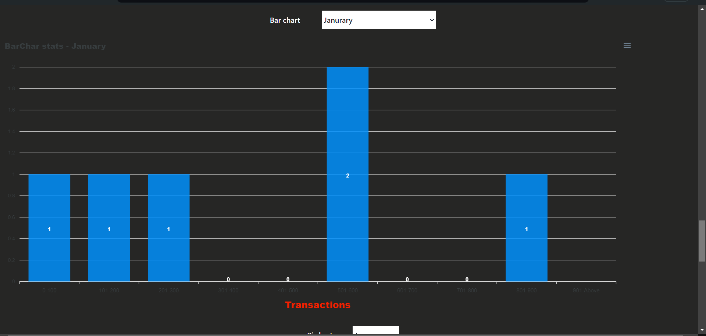

# MERN Stack Coding Challenge #
[project-live](https://merncodingtask.vercel.app/)
   - - - -
 # Project Overview #
   * This project is a __MERN stack application__ designed to fetch and display product transaction data from a third-party API. The application consists of both __backend and frontend__ components, allowing users to __view transactions, perform searches, and visualize statistics__ through charts
   

   - - - - 
* Task  
 
    * Create an API to list all transactions
    * Based on the value of search parameters, it should match search text on product title/description/price and return the matching product transactions.

    * Create an API for statistics, including  
      * Total sale amount of selected month.
      * Total number of sold items of selected month.
      * Total number of not sold items of selected month.
    * Create an API for bar chart data, containing the price range and the number of items in that range for the selected month.
    * Create an API for pie chart data, finding unique categories and the number of items from each category for the selected month  
    * Create an API to fetch data from  the  APIs, combine based on month  , and send a final combined JSON response 
  
  

 
 ## Destop view ##
 
  
 
 
 
 
 
 ## Moblie View
  
 
 
  
  
   